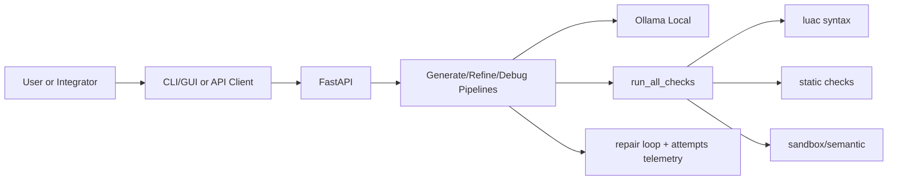

# LocalScript (ветка `json_context`)

Локальная агентская система генерации/доработки Lua-кода для трека МТС LocalScript.  
Версия ориентирована на stateless tim-style API: сервер не хранит диалоговую сессию, клиент каждый раз передает всю историю в теле запроса.

## 1) Задача и инженерные требования

Репозиторий реализует решение под ограничения трека:
- локальная lightweight LLM через Ollama;
- отсутствие внешних AI-вендоров в runtime;
- генерация Lua с валидацией и repair loop;
- поддержка агентных итераций (clarification/refine/debug);
- воспроизводимый запуск для MLOps/DevOps контура.

Контекст задания: `instruction.txt`.  
Контракт API: `localscript-openapi.yaml`.

## 2) Ключевая идея решения

В отличие от explicit-clarify подхода, здесь clarification встроен в основной endpoint генерации:
- `POST /generate` возвращает либо `response_kind=clarification`, либо `response_kind=code`;
- клиент отвечает и снова вызывает `POST /generate`, передавая обновленный `clarification_history`.

Доработка и отладка:
- `POST /refine` работает через `refinement_history` (непустая цепочка шагов);
- `POST /debug` запускает проверки текущего Lua и один review-раунд модели с `debug_history`.

## 3) Структура репозитория

- `localscript-agent/` — сервис (FastAPI + pipeline + проверки + demo clients).
- `localscript-openapi.yaml` — OpenAPI контракт этой версии.
- `docs/INSTALL_WINDOWS.md`, `docs/INSTALL_LINUX.md` — установка на платформах.

Ключевые компоненты:
- `localscript-agent/app/main.py` — endpoints `/health`, `/generate`, `/refine`, `/debug`.
- `localscript-agent/app/pipeline.py` — orchestration generate/refine/debug + repair loop.
- `localscript-agent/app/code_checks.py` — `run_all_checks` (syntax/static/sandbox/semantic).
- `localscript-agent/app/generate_parse.py` — parse JSON-ответа модели.
- `localscript-agent/scripts/demo_cli.py` — интерактивный CLI.
- `localscript-agent/scripts/demo_streamlit.py` — GUI.

## 4) Архитектура



## 5) API

База: `http://127.0.0.1:8080`  
Контракт: `localscript-openapi.yaml`

Эндпоинты:
- `GET /health` — состояние сервиса/Ollama/модели.
- `POST /generate` — новый запрос, может вернуть уточняющий вопрос до кода.
- `POST /refine` — следующая итерация с `refinement_history`.
- `POST /debug` — проверки + объяснение проблемы + `suggested_code`.

Ключевые поля ответа `generate/refine`:
- `response_kind` (`clarification` | `code`),
- `attempts` (история initial/repair попыток и checks),
- `all_checks_passed`, `degraded`, `stop_reason`,
- `llm_rounds`, `repair_rounds_used`,
- `parse_warning` (если сработал fallback parser).

Коды:
- `200` — OK,
- `422` — validation error,
- `502` — upstream/parse/runtime pipeline error.

## 6) Установка и запуск

### 6.1 Docker Compose (рекомендуется)

```bash
cd localscript-agent
docker compose up --build
```

После старта:
- API: `http://127.0.0.1:8080`
- Ollama: `http://127.0.0.1:11434`
- default model: `qwen2.5-coder:7b`

Рекомендуемые параметры (из условий трека):
- `NUM_CTX=4096`
- `NUM_PREDICT=256`
- `NUM_BATCH=1`
- `NUM_PARALLEL=1`
- `OLLAMA_NUM_GPU=999`

### 6.2 Локальный dev-режим

```bash
cd localscript-agent
./scripts/bootstrap_dev.sh
conda activate localscript-agent
uvicorn app.main:app --reload --host 0.0.0.0 --port 8080
```

Нужны `lua`/`luac` в `PATH`.

## 7) Эксплуатация: CLI и GUI

### CLI (основной интерактивный контур)

```bash
cd localscript-agent
python scripts/demo_cli.py
```

Полезные флаги:
- `--base-url`
- `--timeout`
- `--context-file`
- `--verbose`

Основные команды:
- `/health`, `/settings`, `/url <url>`
- `/ctx <file.json>`, `/ctx show`, `/ctx clear`
- `/refine`
- `/debug`, `/debug <text>`, `/debug new`
- `/log`, `/log N`, `/log all`, `/log clear`
- `/help`, `/quit`

Важно: часть удобного поведения (например, подстановка предыдущего `suggested_code` в `/debug`) реализована на уровне CLI, а не HTTP-контракта.

### GUI (Streamlit)

```bash
cd localscript-agent
python -m streamlit run scripts/demo_streamlit.py
```

GUI дает:
- визуальный workflow generate/refine/debug;
- clarification chat в stateless-модели;
- переключатель семантической валидации;
- chat history save/load/clear;
- загрузку выбранного шага в панель ответа.

История сохраняется в `localscript-agent/artifacts/gui_chat_history.jsonl`.

## 8) Тесты, качество, оценка

```bash
cd localscript-agent
ruff check .
pytest -q
```

Публичная выборка:

```bash
python scripts/eval_public.py --http --base-url http://127.0.0.1:8080
```

или direct:

```bash
python scripts/eval_public.py
```

## 9) Отличия от версии `lua_manual`

Ключевые различия:
- **Clarification API**: здесь нет отдельных `/clarify` и `/generate-from-clarify`; вопросы приходят из `POST /generate` через `response_kind=clarification`.
- **Debug**: здесь есть `POST /debug`; в `lua_manual` его нет.
- **Модель данных API**: здесь rich telemetry (`attempts`, `stop_reason`, `degraded`, `llm_rounds`), в `lua_manual` акцент на `confidence_gate_triggered` и `repair_report`.
- **CLI**: здесь есть полнофункциональный `scripts/demo_cli.py`; в `lua_manual` нет REPL-клиента.
- **Интеграция контекста**: здесь семантический JSON-контекст обычно встраивается в `prompt` (`Context:`) и извлекается сервером в pipeline; в `lua_manual` есть явные поля `context` и отдельный clarify-flow.

## 10) Дополнительные документы

- `localscript-agent/README.md`
- `localscript-agent/docs/SETUP_GUIDE.md`
- `localscript-agent/docs/AGENT_WORKFLOW.md`
- `localscript-agent/docs/CLI_CURRENT_BEHAVIOR.md`
- `localscript-agent/docs/SUBMISSION.md`
