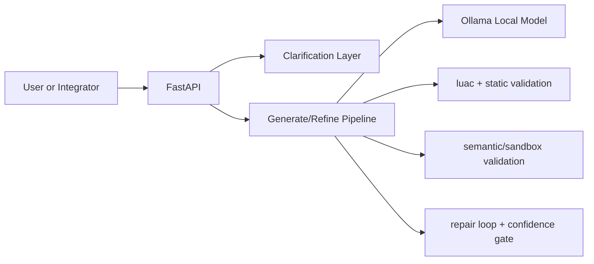

# LocalScript (ветка `lua_manual`)

Локальная агентская система для генерации и валидации Lua-кода под требования трека МТС LocalScript: без внешних AI API в runtime, с reproducible-запуском и эксплуатационным контуром для MLOps/DevOps.

## 1) Задача и ограничения

Решение закрывает базовые требования трека:
- генерация Lua по задаче на естественном языке;
- минимум одна итерация агентного поведения (уточнение/доработка);
- локальный запуск open-source LLM через Ollama;
- отсутствие отправки данных во внешние LLM-сервисы;
- проверяемый pipeline валидации (синтаксис, статические правила, sandbox/семантика);
- воспроизводимый запуск одной командой.

Формальное условие: `instruction.txt`.

## 2) Что реализовано

Эта версия строится вокруг явного API-потока:
1. `POST /clarify` — сбор недостающего контекста.
2. `POST /generate-from-clarify` — генерация из уточненного контекста.
3. `POST /refine` — итеративная доработка предыдущего кода.
4. `POST /generate` — прямой путь генерации/итерации без шага clarify.

Проверки кода в pipeline:
- `luac` (синтаксис),
- статические ограничения (безопасные конструкции),
- опциональная семантическая проверка (sandbox + `__semantic_validation` в контексте),
- repair loop с confidence gate и отчетом (`repair_report`) при исчерпании попыток.

## 3) Структура репозитория

- `localscript-agent/` — основной сервис (FastAPI, pipeline, проверки, UI scripts, тесты).
- `localscript-openapi.yaml` — контракт API для этой версии.
- `docs/INSTALL_WINDOWS.md`, `docs/INSTALL_LINUX.md` — платформенные шаги установки.
- `instruction.txt` — исходное условие трека.

Ключевые файлы в сервисе:
- `localscript-agent/app/main.py` — HTTP endpoints.
- `localscript-agent/app/pipeline.py` — generate/repair loop.
- `localscript-agent/app/clarify.py` — логика вопросов и merge-контекста.
- `localscript-agent/app/validate.py`, `localscript-agent/app/sandbox.py`, `localscript-agent/app/semantic.py` — проверки.
- `localscript-agent/scripts/demo_streamlit.py` — GUI-клиент.
- `localscript-agent/scripts/eval_public.py` — оценка на публичной выборке.

## 4) Архитектура



Архитектурный черновик C4: `localscript-agent/docs/architecture.md`.

## 5) API

Базовый URL: `http://127.0.0.1:8080`  
Контракт: `localscript-openapi.yaml`

Эндпоинты:
- `GET /health` — readiness API + Ollama + модель + инференс-параметры.
- `POST /clarify` — возвращает `questions`, `assumptions`, `merged_context`.
- `POST /generate-from-clarify` — либо `need_clarification`, либо `generated` с кодом.
- `POST /generate` — генерация кода (с optional `context`, `previous_code`, `feedback`).
- `POST /refine` — итеративная доработка (`prompt`, `previous_code`, `feedback`).

Типовые ответы:
- `200` — успешная обработка,
- `422` — ошибка валидации входа,
- `502` — ошибка upstream/pipeline.

## 6) Установка и запуск

### 6.1 Рекомендуемый путь (Docker Compose)

Из корня репозитория:

```bash
cd localscript-agent && docker compose up --build
```

После старта:
- API: `http://127.0.0.1:8080`
- Ollama: `http://127.0.0.1:11434`
- модель: `qwen2.5-coder:7b`

Рекомендуемые параметры трека:
- `NUM_CTX=4096`
- `NUM_PREDICT=256`
- `NUM_BATCH=1`
- `NUM_PARALLEL=1`
- `OLLAMA_NUM_GPU=999` (полный оффлоад на GPU)

В этой ветке в `docker-compose.yml` включен warmup:
- `OLLAMA_WARMUP_ENABLED=true`
- `OLLAMA_WARMUP_TIMEOUT_SECONDS=240`
- `OLLAMA_HEALTH_TIMEOUT_SECONDS=5`

### 6.2 Локальная разработка (без Docker)

```bash
cd localscript-agent
./scripts/bootstrap_dev.sh
conda activate localscript-agent
uvicorn app.main:app --reload --host 0.0.0.0 --port 8080
```

Нужны `lua` и `luac` в `PATH`.

## 7) Эксплуатация: GUI и CLI

### GUI (Streamlit)

```bash
cd localscript-agent
python -m streamlit run scripts/demo_streamlit.py
```

GUI поддерживает:
- `/health`, `/clarify`, `/generate`, `/generate-from-clarify`, `/refine`;
- валидацию входных JSON полей (context/answers/semantic rules);
- инъекцию `__semantic_validation` в `context`;
- copy-flow (`Use merged_context`, `Use code as previous_code`).

### CLI (без отдельного интерактивного клиента)

В этой ветке нет standalone CLI REPL-скрипта (в отличие от `json_context`-версии).  
Для CLI-эксплуатации используются стандартные инструменты (`curl`, PowerShell, CI job wrappers).

Примеры:

```bash
curl -s http://127.0.0.1:8080/health
```

```bash
curl -s http://127.0.0.1:8080/generate \
  -H "Content-Type: application/json" \
  -d "{\"prompt\":\"Верни сумму элементов массива\"}"
```

```bash
curl -s http://127.0.0.1:8080/refine \
  -H "Content-Type: application/json" \
  -d "{\"prompt\":\"Верни сумму элементов массива\",\"previous_code\":\"return 0\",\"feedback\":\"Используй входной массив\"}"
```

## 8) Тестирование и quality gates

```bash
cd localscript-agent
ruff check .
pytest -q
```

Проверки и артефакты:
- `localscript-agent/tests/` — unit/smoke tests для clarify, repair gate, validate, semantic.
- `localscript-agent/scripts/quality.sh` — агрегированный запуск quality gate.
- `localscript-agent/scripts/eval_public.py` — offline метрики на публичной выборке.

## 9) Сравнение с альтернативной веткой (`json_context`)

Главные различия:
- **API agentness**: здесь explicit endpoints `/clarify` и `/generate-from-clarify`; в `json_context` clarification встроен в `POST /generate` как ветка `response_kind=clarification`.
- **Debug API**: здесь нет `POST /debug`; в `json_context` есть отдельный debug-контур.
- **CLI**: здесь нет интерактивного REPL-клиента; в `json_context` есть `scripts/demo_cli.py`.
- **Repair telemetry**: здесь ключевой результат confidence gate (`confidence_gate_triggered`, `repair_report`); в `json_context` — структура `attempts`, `stop_reason`, `degraded`, `llm_rounds`.
- **Compose warmup**: здесь есть warmup-переменные в compose; в `json_context` compose проще.

## 10) Полезные документы

- `localscript-agent/README.md` — README подпроекта.
- `localscript-agent/docs/SETUP_GUIDE.md` — детальная установка.
- `localscript-agent/docs/AGENT_WORKFLOW.md` — workflow агента.
- `localscript-agent/docs/SUBMISSION.md` — артефакты сдачи.
