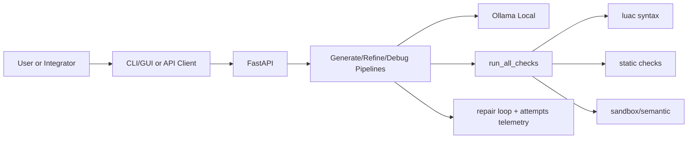

# LocalScript (ветка `json_context`)

Это локальная агентская система для генерации и доработки Lua-кода в треке МТС LocalScript.  
API сделан в stateless-режиме: сервер не хранит сессию, клиент каждый раз отправляет всю историю в теле запроса.

## Что здесь решается

Репозиторий закрывает базовые ограничения трека:
- локальная LLM через `Ollama`;
- без внешних AI-вендоров в runtime;
- генерация Lua с проверками и repair loop;
- итерации `clarification` / `refine` / `debug`;
- воспроизводимый запуск под MLOps/DevOps.

Контекст задания лежит в `instruction.txt`.  
OpenAPI-контракт: `localscript-openapi.yaml`.

## Как устроен flow

Вопросы на уточнение встроены прямо в генерацию:
- `POST /generate` возвращает либо `response_kind=clarification`, либо `response_kind=code`;
- клиент дополняет `clarification_history` и снова вызывает `POST /generate`.

Доработка и отладка вынесены отдельно:
- `POST /refine` использует непустой `refinement_history`;
- `POST /debug` прогоняет проверки Lua и делает review-раунд модели с `debug_history`.

## Структура репозитория

- `localscript-agent/` - основной сервис (`FastAPI`, pipeline, проверки, demo-клиенты).
- `localscript-openapi.yaml` - актуальный API-контракт.
- `docs/INSTALL_WINDOWS.md`, `docs/INSTALL_LINUX.md` - установка.

Ключевые файлы:
- `localscript-agent/app/main.py` - `/health`, `/generate`, `/refine`, `/debug`;
- `localscript-agent/app/pipeline.py` - orchestration generate/refine/debug + repair loop;
- `localscript-agent/app/code_checks.py` - `run_all_checks` (syntax/static/sandbox/semantic);
- `localscript-agent/app/generate_parse.py` - парсинг JSON-ответа модели;
- `localscript-agent/scripts/demo_cli.py` - интерактивный CLI;
- `localscript-agent/scripts/demo_streamlit.py` - GUI.

## Архитектура



## API

База: `http://127.0.0.1:8080`  
Контракт: `localscript-openapi.yaml`

Эндпоинты:
- `GET /health` - проверка сервиса, `Ollama` и модели;
- `POST /generate` - стартовая генерация, при необходимости возвращает вопрос;
- `POST /refine` - следующая итерация по `refinement_history`;
- `POST /debug` - проверки, объяснение проблемы и `suggested_code`.

Важные поля в `generate/refine`:
- `response_kind` (`clarification` | `code`);
- `attempts` (история initial/repair попыток и checks);
- `all_checks_passed`, `degraded`, `stop_reason`;
- `llm_rounds`, `repair_rounds_used`;
- `parse_warning` (если включился fallback parser).

HTTP-коды:
- `200` - успех;
- `422` - ошибка валидации;
- `502` - upstream/parse/runtime ошибка pipeline.

## Установка и запуск

### Docker Compose (рекомендуется)

```bash
cd localscript-agent
docker compose up --build
```

После старта:
- API: `http://127.0.0.1:8080`
- Ollama: `http://127.0.0.1:11434`
- модель по умолчанию: `qwen2.5-coder:7b`

Рекомендованные параметры (по условиям трека):
- `NUM_CTX=4096`
- `NUM_PREDICT=256`
- `NUM_BATCH=1`
- `NUM_PARALLEL=1`
- `OLLAMA_NUM_GPU=999`

### Локальный dev-режим

```bash
cd localscript-agent
./scripts/bootstrap_dev.sh
conda activate localscript-agent
uvicorn app.main:app --reload --host 0.0.0.0 --port 8080
```

Нужны `lua` и `luac` в `PATH`.

## CLI и GUI

### CLI

```bash
cd localscript-agent
python scripts/demo_cli.py
```

Полезные флаги:
- `--base-url`
- `--timeout`
- `--context-file`
- `--verbose`

Команды:
- `/health`, `/settings`, `/url <url>`
- `/ctx <file.json>`, `/ctx show`, `/ctx clear`
- `/refine`
- `/debug`, `/debug <text>`, `/debug new`
- `/log`, `/log N`, `/log all`, `/log clear`
- `/help`, `/quit`

Часть удобства реализована именно в CLI (например, подстановка предыдущего `suggested_code` в `/debug`), а не в HTTP-контракте.

### GUI (Streamlit)

```bash
cd localscript-agent
python -m streamlit run scripts/demo_streamlit.py
```

GUI поддерживает:
- визуальный flow generate/refine/debug;
- clarification chat в stateless-модели;
- переключение семантической валидации;
- сохранение и загрузку истории;
- перенос выбранного шага в панель ответа.

История хранится в `localscript-agent/artifacts/gui_chat_history.jsonl`.

## Тесты и оценка

```bash
cd localscript-agent
ruff check .
pytest -q
```

Публичная выборка (HTTP-режим):

```bash
python scripts/eval_public.py --http --base-url http://127.0.0.1:8080
```

Или direct/in-process:

```bash
python scripts/eval_public.py
```

## Чем отличается от `lua_manual`

- нет отдельных `/clarify` и `/generate-from-clarify`, уточнения приходят через `POST /generate`;
- есть `POST /debug`;
- богаче telemetry (`attempts`, `stop_reason`, `degraded`, `llm_rounds`);
- есть полноценный `scripts/demo_cli.py`;
- контекст обычно встраивается в `prompt` как `Context:` и извлекается сервером в pipeline.

## Дополнительные документы

- `localscript-agent/README.md`
- `localscript-agent/docs/SETUP_GUIDE.md`
- `localscript-agent/docs/AGENT_WORKFLOW.md`
- `localscript-agent/docs/CLI_CURRENT_BEHAVIOR.md`
- `localscript-agent/docs/SUBMISSION.md`
